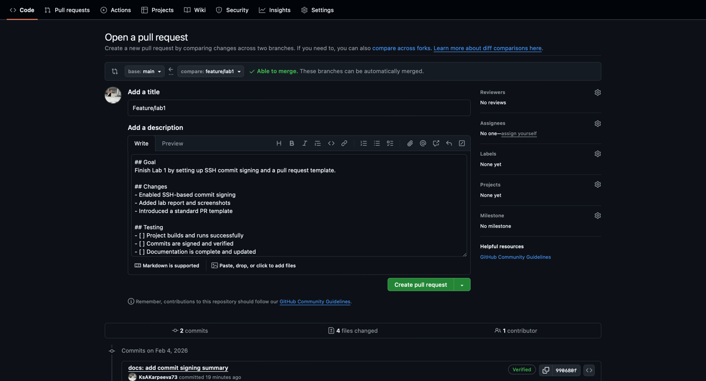
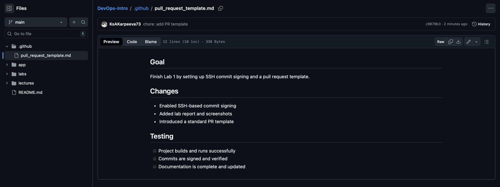

# Lab 1

## Task 1: SSH Commit Signature Verification

**Summary of the benefits of signing commits**

My answer:

Signing Git commits shows that the commit was really created by you. A digital signature is added to the commit using your private key.

First, it confirms the author. A signed commit proves that the code was made by the real owner of the account, not someone else using the same name or email. On platforms like GitHub, this is shown with a *Verified* badge, which helps others trust the commit.

Second, it protects the commit from changes. The signature checks that the code, message, and author information were not modified after the commit was created. If anything is changed, the signature becomes invalid.

Commit signing is important for project security, especially in team and open-source projects. It helps prevent fake commits and makes it clear who made each change.

In short, signing commits is a simple way to make your project history more secure and trustworthy.

**Evidence of successful SSH key setup and signed commit.**

  

**Question: "Why is commit signing important in DevOps workflows?"**

My answer:

In DevOps workflows, automation is widely used. CI/CD pipelines automatically build and deploy code.
If an attacker pretends to be a developer and pushes harmful code, the pipeline may deploy it to production.
Commit signing helps prevent this. Pipelines can be set to accept only commits signed with trusted keys.
This adds an extra layer of protection to the software supply chain.

**Screenshots or verification of the "Verified" badge on GitHub.**

  

## Task 2: PR Template and Checklist

**Screenshot of PR template filling the desc**

  

**Evidence that .github/pull_request_template.md exists on main branch.**

  The file exists at `.github/pull_request_template.md`.
  

**Analysis of how PR templates improve collaboration**

PR templates make the code review process more organized and easier to follow.

1. **Clear information:** Each pull request includes a clear goal and list of changes, so reviewers immediately understand what was done.
2. **Same structure:** All contributors use the same format, which makes reviews faster and more consistent.
3. **Better quality:** Checklists remind authors to test their code and update documentation before opening a PR, which reduces extra comments and rework.

**Challenges during setup**

The main issue was the setup order. The PR template must be added and pushed to the `main` branch before creating a pull request. If this is not done, GitHub does not apply the template automatically.
