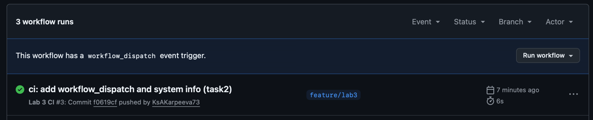
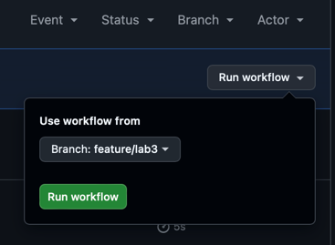
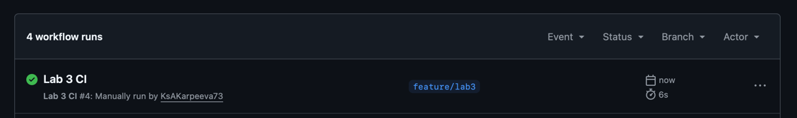
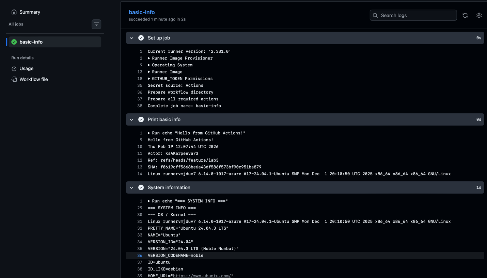

## Lab 3 (GitHub Actions) 

### Task 1

### Что было сделанo

1. Создана отдельная ветка для лабы: `feature/lab3`.
2. Добавлен workflow GitHub Actions в правильную директорию репозитория: `.github/workflows/`.
3. Workflow настроен на автоматический запуск при `push` в ветку `feature/lab3`.
4. Внутри job добавлен шаг, который печатает базовую информацию о запуске (дата/время, актор, ref, SHA, ОС runner’а).

### Доказательства

Успешный запуск job `basic-info`:

GitHub:

Ссылка на лог job:
[https://github.com/KsAKarpeeva73/DevOps-Intro/actions/runs/22180571407/job/64140491668#step:1:2](https://github.com/KsAKarpeeva73/DevOps-Intro/actions/runs/22180571407/job/64140491668#step:1:2)


### Почему workflow запустился

Workflow был запущен автоматически из-за события **`push`** в ветку `feature/lab3` (это указано в секции `on: push` в YAML). После коммита и пуша GitHub создал новый run в разделе **Actions**, выполнил job и показал логи.

### Ключевые понятия, которые проявились на практике

* **Workflow** — YAML-файл, который описывает автоматизацию (что запускать и когда).
* **Trigger (event)** — событие, которое запускает workflow (здесь: `push`).
* **Job** — набор шагов, выполняемых на одном runner’е (здесь: `basic-info`).
* **Steps** — последовательные команды внутри job (здесь: `echo`, `date`, переменные окружения, `uname -a`).
* **Runner** — виртуальная машина, на которой выполняется job (здесь: `ubuntu-latest`).

### Фрагмент лога 
```log
basic-info
succeeded 4 minutes ago in 4s

0s
Current runner version: '2.331.0'
Runner Image Provisioner
Operating System
Runner Image
GITHUB_TOKEN Permissions
Secret source: Actions
Prepare workflow directory
Prepare all required actions
Complete job name: basic-info
0s
Run echo "Hello from GitHub Actions!"
Hello from GitHub Actions!
Thu Feb 19 11:50:00 UTC 2026
Actor: KsAKarpeeva73
Ref: refs/heads/feature/lab3
SHA: 2f63fe4487493743fb51b0f847f574b94cafe817
Linux runnervmjduv7 6.14.0-1017-azure #17~24.04.1-Ubuntu SMP Mon Dec  1 20:10:50 UTC 2025 x86_64 x86_64 x86_64 GNU/Linux
0s
Cleaning up orphan processes
```


Ок, под твой формат — вот **что именно вписать в `labs/submission3.md` для Task 2 (GitHub Actions)**. Я сделаю так, чтобы это закрывало пункты из чеклиста (изменения в YAML, системная инфа, сравнение manual/auto, короткий анализ, скриншоты).

---

## Task 2

### Что поменялось 

Файл: `.github/workflows/lab3.yml`

1. Добавил(а) ручной запуск:

```yaml
workflow_dispatch:
```
```log
      - name: System information
        run: |
          echo "=== SYSTEM INFO ==="
          echo "--- OS / Kernel ---"
          uname -a
          cat /etc/os-release || true

          echo "--- CPU ---"
          nproc
          lscpu || true
          cat /proc/cpuinfo | head -n 30 || true

          echo "--- Memory ---"
          free -h || true
          cat /proc/meminfo | head -n 20 || true

          echo "--- Disk ---"
          df -h
          lsblk || true

          echo "--- GitHub runner env ---"
          echo "RUNNER_OS=$RUNNER_OS"
          echo "RUNNER_ARCH=$RUNNER_ARCH"
          echo "RUNNER_NAME=$RUNNER_NAME"
          echo "RUNNER_TEMP=$RUNNER_TEMP"
          echo "GITHUB_WORKFLOW=$GITHUB_WORKFLOW"
          echo "GITHUB_RUN_ID=$GITHUB_RUN_ID"
          echo "GITHUB_RUN_NUMBER=$GITHUB_RUN_NUMBER"
```

---

### Доказательства

Run: https://github.com/KsAKarpeeva73/DevOps-Intro/actions/runs/22181120803/job/64142367015







---

### Что вывелось в логах

```log
basic-info
succeeded 5 minutes ago in 2s

0s
Current runner version: '2.331.0'
Runner Image Provisioner
Operating System
Runner Image
GITHUB_TOKEN Permissions
Secret source: Actions
Prepare workflow directory
Prepare all required actions
Complete job name: basic-info
0s
Run echo "Hello from GitHub Actions!"
Hello from GitHub Actions!
Thu Feb 19 12:07:44 UTC 2026
Actor: KsAKarpeeva73
Ref: refs/heads/feature/lab3
SHA: f0619cff5668be6a43df586f573bf90c951ba879
Linux runnervmjduv7 6.14.0-1017-azure #17~24.04.1-Ubuntu SMP Mon Dec  1 20:10:50 UTC 2025 x86_64 x86_64 x86_64 GNU/Linux
1s
Run echo "=== SYSTEM INFO ==="
=== SYSTEM INFO ===
--- OS / Kernel ---
Linux runnervmjduv7 6.14.0-1017-azure #17~24.04.1-Ubuntu SMP Mon Dec  1 20:10:50 UTC 2025 x86_64 x86_64 x86_64 GNU/Linux
PRETTY_NAME="Ubuntu 24.04.3 LTS"
NAME="Ubuntu"
VERSION_ID="24.04"
VERSION="24.04.3 LTS (Noble Numbat)"
VERSION_CODENAME=noble
ID=ubuntu
ID_LIKE=debian
HOME_URL="https://www.ubuntu.com/"
SUPPORT_URL="https://help.ubuntu.com/"
BUG_REPORT_URL="https://bugs.launchpad.net/ubuntu/"
PRIVACY_POLICY_URL="https://www.ubuntu.com/legal/terms-and-policies/privacy-policy"
UBUNTU_CODENAME=noble
LOGO=ubuntu-logo
--- CPU ---
4
Architecture:                            x86_64
CPU op-mode(s):                          32-bit, 64-bit
Address sizes:                           48 bits physical, 48 bits virtual
Byte Order:                              Little Endian
CPU(s):                                  4
On-line CPU(s) list:                     0-3
Vendor ID:                               AuthenticAMD
Model name:                              AMD EPYC 7763 64-Core Processor
CPU family:                              25
Model:                                   1
Thread(s) per core:                      2
Core(s) per socket:                      2
Socket(s):                               1
Stepping:                                1
BogoMIPS:                                4890.86
Flags:                                   fpu vme de pse tsc msr pae mce cx8 apic sep mtrr pge mca cmov pat pse36 clflush mmx fxsr sse sse2 ht syscall nx mmxext fxsr_opt pdpe1gb rdtscp lm constant_tsc rep_good nopl tsc_reliable nonstop_tsc cpuid extd_apicid aperfmperf tsc_known_freq pni pclmulqdq ssse3 fma cx16 pcid sse4_1 sse4_2 movbe popcnt aes xsave avx f16c rdrand hypervisor lahf_lm cmp_legacy svm cr8_legacy abm sse4a misalignsse 3dnowprefetch osvw topoext vmmcall fsgsbase bmi1 avx2 smep bmi2 erms invpcid rdseed adx smap clflushopt clwb sha_ni xsaveopt xsavec xgetbv1 xsaves user_shstk clzero xsaveerptr rdpru arat npt nrip_save tsc_scale vmcb_clean flushbyasid decodeassists pausefilter pfthreshold v_vmsave_vmload umip vaes vpclmulqdq rdpid fsrm
Virtualization:                          AMD-V
Hypervisor vendor:                       Microsoft
Virtualization type:                     full
L1d cache:                               64 KiB (2 instances)
L1i cache:                               64 KiB (2 instances)
L2 cache:                                1 MiB (2 instances)
L3 cache:                                32 MiB (1 instance)
NUMA node(s):                            1
NUMA node0 CPU(s):                       0-3
Vulnerability Gather data sampling:      Not affected
Vulnerability Ghostwrite:                Not affected
Vulnerability Indirect target selection: Not affected
Vulnerability Itlb multihit:             Not affected
Vulnerability L1tf:                      Not affected
Vulnerability Mds:                       Not affected
Vulnerability Meltdown:                  Not affected
Vulnerability Mmio stale data:           Not affected
Vulnerability Reg file data sampling:    Not affected
Vulnerability Retbleed:                  Not affected
Vulnerability Spec rstack overflow:      Vulnerable: Safe RET, no microcode
Vulnerability Spec store bypass:         Vulnerable
Vulnerability Spectre v1:                Mitigation; usercopy/swapgs barriers and __user pointer sanitization
Vulnerability Spectre v2:                Mitigation; Retpolines; STIBP disabled; RSB filling; PBRSB-eIBRS Not affected; BHI Not affected
Vulnerability Srbds:                     Not affected
Vulnerability Tsa:                       Vulnerable: Clear CPU buffers attempted, no microcode
Vulnerability Tsx async abort:           Not affected
Vulnerability Vmscape:                   Not affected
processor	: 0
vendor_id	: AuthenticAMD
cpu family	: 25
model		: 1
model name	: AMD EPYC 7763 64-Core Processor
stepping	: 1
microcode	: 0xffffffff
cpu MHz		: 3222.341
cache size	: 512 KB
physical id	: 0
siblings	: 4
core id		: 0
cpu cores	: 2
apicid		: 0
initial apicid	: 0
fpu		: yes
fpu_exception	: yes
cpuid level	: 13
wp		: yes
flags		: fpu vme de pse tsc msr pae mce cx8 apic sep mtrr pge mca cmov pat pse36 clflush mmx fxsr sse sse2 ht syscall nx mmxext fxsr_opt pdpe1gb rdtscp lm constant_tsc rep_good nopl tsc_reliable nonstop_tsc cpuid extd_apicid aperfmperf tsc_known_freq pni pclmulqdq ssse3 fma cx16 pcid sse4_1 sse4_2 movbe popcnt aes xsave avx f16c rdrand hypervisor lahf_lm cmp_legacy svm cr8_legacy abm sse4a misalignsse 3dnowprefetch osvw topoext vmmcall fsgsbase bmi1 avx2 smep bmi2 erms invpcid rdseed adx smap clflushopt clwb sha_ni xsaveopt xsavec xgetbv1 xsaves user_shstk clzero xsaveerptr rdpru arat npt nrip_save tsc_scale vmcb_clean flushbyasid decodeassists pausefilter pfthreshold v_vmsave_vmload umip vaes vpclmulqdq rdpid fsrm
bugs		: sysret_ss_attrs null_seg spectre_v1 spectre_v2 spec_store_bypass srso tsa
bogomips	: 4890.86
TLB size	: 2560 4K pages
clflush size	: 64
cache_alignment	: 64
address sizes	: 48 bits physical, 48 bits virtual
power management:

processor	: 1
vendor_id	: AuthenticAMD
--- Memory ---
               total        used        free      shared  buff/cache   available
Mem:            15Gi       781Mi        13Gi        35Mi       1.8Gi        14Gi
Swap:          3.0Gi          0B       3.0Gi
MemTotal:       16378532 kB
MemFree:        14030256 kB
MemAvailable:   15577804 kB
Buffers:           52880 kB
Cached:          1764808 kB
SwapCached:            0 kB
Active:           618396 kB
Inactive:        1419216 kB
Active(anon):     264908 kB
Inactive(anon):        0 kB
Active(file):     353488 kB
Inactive(file):  1419216 kB
Unevictable:       46752 kB
Mlocked:           43680 kB
SwapTotal:       3145724 kB
SwapFree:        3145724 kB
Zswap:                 0 kB
Zswapped:              0 kB
Dirty:               368 kB
Writeback:             0 kB
--- Disk ---
Filesystem      Size  Used Avail Use% Mounted on
/dev/root       145G   53G   92G  37% /
tmpfs           7.9G   84K  7.9G   1% /dev/shm
tmpfs           3.2G 1000K  3.2G   1% /run
tmpfs           5.0M     0  5.0M   0% /run/lock
efivarfs        128M   29K  128M   1% /sys/firmware/efi/efivars
/dev/sda16      881M   63M  757M   8% /boot
/dev/sda15      105M  6.2M   99M   6% /boot/efi
tmpfs           1.6G   12K  1.6G   1% /run/user/1001
NAME    MAJ:MIN RM  SIZE RO TYPE MOUNTPOINTS
sda       8:0    0  150G  0 disk 
├─sda1    8:1    0  149G  0 part /
├─sda14   8:14   0    4M  0 part 
├─sda15   8:15   0  106M  0 part /boot/efi
└─sda16 259:0    0  913M  0 part /boot
--- GitHub runner env ---
RUNNER_OS=Linux
RUNNER_ARCH=X64
RUNNER_NAME=GitHub Actions 1000000003
RUNNER_TEMP=/home/runner/work/_temp
GITHUB_WORKFLOW=Lab 3 CI
GITHUB_RUN_ID=22181120803
GITHUB_RUN_NUMBER=4
0s
Cleaning up orphan processes
```

---

### Сравнение ручного и автоматического запуска

* **Автоматический запуск (`push`)** — workflow сам стартует при пуше в ветку `feature/lab3`.
* **Ручной запуск (`workflow_dispatch`)** — workflow запускается из интерфейса GitHub кнопкой **Run workflow**, без новых коммитов. Это удобно, когда нужно просто перепроверить окружение runner’а или прогнать workflow ещё раз.

---

### Короткий анализ окружения runner

Runner — стандартная виртуалка GitHub Actions на Ubuntu 24.04 LTS (Noble).
По логам видно, что окружение типичное для CI: Linux x86_64, доступ к базовым системным утилитам (`lscpu`, `free`, `df`, `lsblk`). Подходит для тестов/сборок, где нужно быстро получить повторяемое окружение.

# *.github/workflows/lab3.yml*

```yaml
name: Lab 3 CI

on:
  push:
    branches:
      - feature/lab3
  workflow_dispatch:

jobs:
  basic-info:
    runs-on: ubuntu-latest
    steps:
      - name: Print basic info
        run: |
          echo "Hello from GitHub Actions!"
          date
          echo "Actor: $GITHUB_ACTOR"
          echo "Ref: $GITHUB_REF"
          echo "SHA: $GITHUB_SHA"
          uname -a

      - name: System information
        run: |
          echo "=== SYSTEM INFO ==="
          echo "--- OS / Kernel ---"
          uname -a
          cat /etc/os-release || true

          echo "--- CPU ---"
          nproc
          lscpu || true
          cat /proc/cpuinfo | head -n 30 || true

          echo "--- Memory ---"
          free -h || true
          cat /proc/meminfo | head -n 20 || true

          echo "--- Disk ---"
          df -h
          lsblk || true

          echo "--- GitHub runner env ---"
          echo "RUNNER_OS=$RUNNER_OS"
          echo "RUNNER_ARCH=$RUNNER_ARCH"
          echo "RUNNER_NAME=$RUNNER_NAME"
          echo "RUNNER_TEMP=$RUNNER_TEMP"
          echo "GITHUB_WORKFLOW=$GITHUB_WORKFLOW"
          echo "GITHUB_RUN_ID=$GITHUB_RUN_ID"
          echo "GITHUB_RUN_NUMBER=$GITHUB_RUN_NUMBER"
```