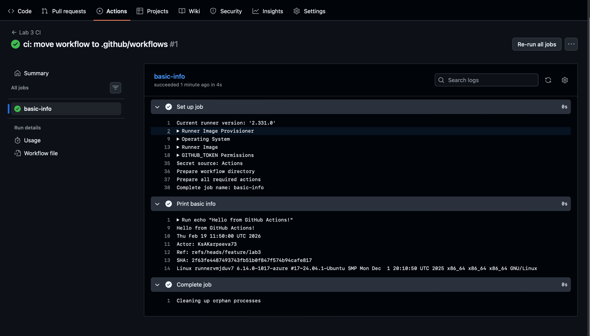

## Lab 3 (GitHub Actions) 

### Task 1

### Что было сделанo

1. Создана отдельная ветка для лабы: `feature/lab3`.
2. Добавлен workflow GitHub Actions в правильную директорию репозитория: `.github/workflows/`.
3. Workflow настроен на автоматический запуск при `push` в ветку `feature/lab3`.
4. Внутри job добавлен шаг, который печатает базовую информацию о запуске (дата/время, актор, ref, SHA, ОС runner’а).

### Доказательства

Успешный запуск job `basic-info`:

GitHub:

Ссылка на лог job:
[https://github.com/KsAKarpeeva73/DevOps-Intro/actions/runs/22180571407/job/64140491668#step:1:2](https://github.com/KsAKarpeeva73/DevOps-Intro/actions/runs/22180571407/job/64140491668#step:1:2)



### Почему workflow запустился

Workflow был запущен автоматически из-за события **`push`** в ветку `feature/lab3` (это указано в секции `on: push` в YAML). После коммита и пуша GitHub создал новый run в разделе **Actions**, выполнил job и показал логи.

### Ключевые понятия, которые проявились на практике

* **Workflow** — YAML-файл, который описывает автоматизацию (что запускать и когда).
* **Trigger (event)** — событие, которое запускает workflow (здесь: `push`).
* **Job** — набор шагов, выполняемых на одном runner’е (здесь: `basic-info`).
* **Steps** — последовательные команды внутри job (здесь: `echo`, `date`, переменные окружения, `uname -a`).
* **Runner** — виртуальная машина, на которой выполняется job (здесь: `ubuntu-latest`).

### Фрагмент лога 
```log
basic-info
succeeded 4 minutes ago in 4s

0s
Current runner version: '2.331.0'
Runner Image Provisioner
Operating System
Runner Image
GITHUB_TOKEN Permissions
Secret source: Actions
Prepare workflow directory
Prepare all required actions
Complete job name: basic-info
0s
Run echo "Hello from GitHub Actions!"
Hello from GitHub Actions!
Thu Feb 19 11:50:00 UTC 2026
Actor: KsAKarpeeva73
Ref: refs/heads/feature/lab3
SHA: 2f63fe4487493743fb51b0f847f574b94cafe817
Linux runnervmjduv7 6.14.0-1017-azure #17~24.04.1-Ubuntu SMP Mon Dec  1 20:10:50 UTC 2025 x86_64 x86_64 x86_64 GNU/Linux
0s
Cleaning up orphan processes
```